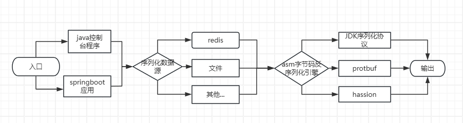
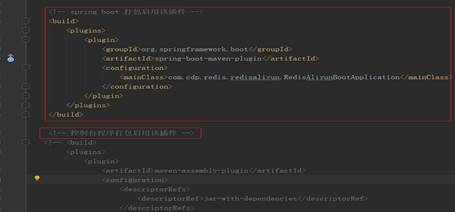
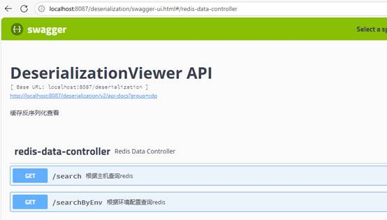
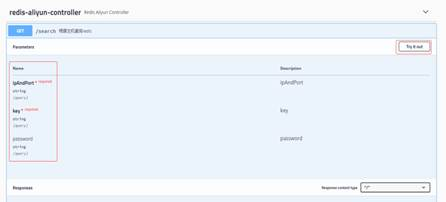
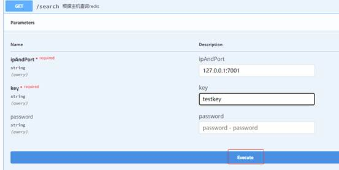
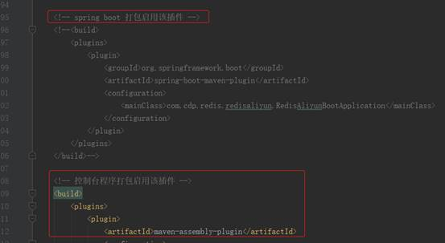
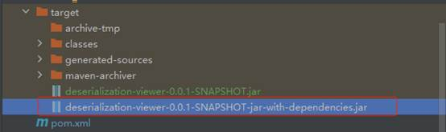

# ldl-DeserializationViewer

#### 介绍
ldl-DeserializationViewer，一款缓存序列化数据可视化查询工具，采用javaasssist和asm字节码生成技术，支持jdk等序列化协议直接转换成json，而无需依赖定义源DTO类，无需依赖serializable接口及serialVersionUID。支持种打包方式，springboot包：配合swagger通过web端访问；普通jar包：直接运行脚本，获取序列化数据可视化结果。

#### 软件架构
软件架构说明

实现效果举例：
JDK序列化数据：
�� sr 1com.datalight.tools.deserialization.model.TestDto��c�� L idt Ljava/lang/Long;L namet Ljava/lang/String;L 	otherInfoq ~ xpsr java.lang.Long;��̏#� J valuexr java.lang.Number������  xp       t 姓名t 学生

反序列化引擎还原数据：
{"id":1,"name":"姓名","otherInfo":"学生"}

#### 安装教程及使用说明

**一，****springboot**方式安装和使用

**1.打包**

在项目路径的pom.xml文件启用spring-boot-maven-plugin打包插件，注释maven-assembly-plugin插件，使其生成springboot的服务包。

maven打包后生成deserialization-viewer-0.0.1-SNAPSHOT.jar

**2. 发布**

把hostconfig.properties上传到对应服务的文件目录，如果目录不存在需要新建；把deserialization-viewer-0.0.1-SNAPSHOT.jar上传到服务器目录，用shell命令进入该目录，执行java -jar redis-aliyun-0.0.1-SNAPSHOT.jar & 命令发布服务, &符表示后台运行。

**3.使用**

前端采用swagger页面，访问路径为http://ip:port/deserialization/swagger-ui.html#

有两种使用方式；

据主机查询：点击Try it out,输入ipAndPort，key，如果配置了redis密码需要输入password否则可以不输入：

点击execute,执行查询

据环境配置查询：

envName参数是在hostconfig.properties中指定的可以动态加载， 返回的数据data是redis中key存储的数据。

**二，控台方式的使用**

1.配置

参考springboot的方式配置

2.打包

注释spring boot 打包插件，启用控制台打包

生成jar包如下：

3.使用

根据ip和端口号使用示例如下：

Java -jar .\deserialization-viewer-0.0.1-SNAPSHOT-jar-with-dependencies.jar 192.168.2.18:7004 testKey

192.168.2.18:7004 是redis服务器的地址和ip如果设置密码可以在后面跟@密码方式，参考springboot的方式；

testKey是要查询的redis的key。

根据环境配置使用示例如下：

Java -jar .\deserialization-viewer-0.0.1-SNAPSHOT-jar-with-dependencies.jar TEST testKey

TEST是在hostconfig.properties中配置的参考springboot方式的配置，testKey是要查的key。

#### 参与贡献

1.  Fork 本仓库
2.  新建 Feat_xxx 分支
3.  提交代码
4.  新建 Pull Request

